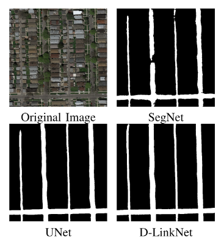
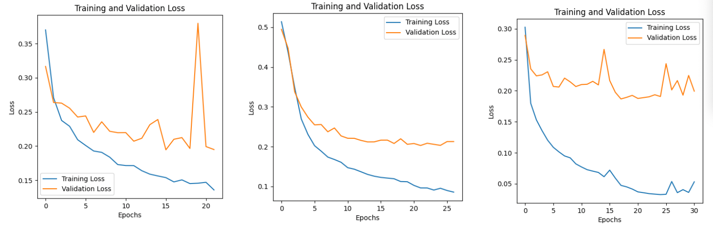

# Machine Learning Approaches for Road Segmentation in Aerial Imagery

> A comparison of state-of-the-art deep learning architectures for high-resolution road segmentation using satellite and aerial imagery.

This project was developed at **EPFL (CS-433)** by  
**Maria Cherchouri, Elsa Heitz, and Antoine Tissot-Favre**  
and explores deep learning pipelines for accurate, large-scale road segmentation from aerial images.

---

## Project Overview

Road segmentation plays a critical role in **navigation, urban planning, and disaster response**.  
Despite recent progress in deep learning, challenges persist due to environmental variability, lighting changes, and complex urban layouts.

We evaluated and optimized several encoder–decoder architectures — **U-Net**, **SegNet**, and **LinkNet variants (NL-LinkNet, D-LinkNet)** — under diverse data augmentation strategies and loss functions to improve **pixel-wise road detection accuracy**.

---

<p align="center">
  
  <br>
  <em>Example predictions: road masks generated by U-Net, SegNet, and D-LinkNet.</em>
</p>

---

## Highlights

| Aspect | Description |
|--------|--------------|
| **Goal** | Robust, high-resolution road segmentation from aerial imagery |
| **Architectures tested** | U-Net, SegNet, NL-LinkNet, D-LinkNet |
| **Augmentations** | Rotations, flips, brightness/contrast shifts, Gaussian noise |
| **Best configuration** | **SegNet + Binary Cross-Entropy loss** |
| **Performance** | F1 = 0.87 · Accuracy = 0.94 (AIcrowd test set) |
| **Key insight** | SegNet offers best recall and generalization; LinkNet yields sharpest boundaries |

---

## Representative Results

### Training Behavior
<p align="center">
  <br>
  <em>Training and validation loss comparison for SegNet, U-Net, and NL-LinkNet (from left to right).</em>
</p>

### Prediction on Test set
See the `Example predictions` figure displayed above.
---

## Repository Structure

```plaintext
📁 Project Root
│
├── README.md
├── requirements.txt
├── docs/
│   └── Report.pdf
├── figures/
│   └── results.png
├── scripts/
│   ├── train.py               # Training entry point
│   ├── predict.py             # Inference CLI
│   ├── generate_submission.py # AIcrowd submission builder
│   └── run_pipeline.py        # End-to-end orchestration
└── src/
    ├── augmentations/
    │   ├── fixed_rot_augmentation.py
    │   └── random_augmentation.py
    ├── data/
    │   └── dataset_import.py  # PyTorch datasets
    ├── models/
    │   ├── linknet.py
    │   ├── segnet.py
    │   ├── unet.py
    │   └── linknet_tools/
    └── utils/
        └── helpers.py
```

---

## Dataset

The project uses the **EPFL AIcrowd Road Segmentation Challenge** dataset:

* 100 RGB training images (400 × 400 px) with binary masks
* 50 RGB test images (608 × 608 px)
* Ground-truth: white = road, black = background

We also incorporated an **additional dataset** from
[Lucci et al., *Learning Aerial Image Segmentation from Online Maps*](https://ieeexplore.ieee.org/document/7987710)
to improve generalization to varied urban and rural scenes.

---

## Data Augmentation

To reduce bias and improve robustness, we applied:

* Fixed and random rotations (15°, 30°, 45°, 60°, 90° …)
* Horizontal/vertical flips
* Brightness and contrast adjustments
* Gaussian noise injection (mean = 0, σ = 0.08)

These transformations are implemented in the reusable modules:

* `python -m src.augmentations.fixed_rot_augmentation`
* `python -m src.augmentations.random_augmentation`

---

## Usage

### 1. Install dependencies

```bash
pip install -r requirements.txt
```

### 2. Prepare data

Organize datasets as:

```plaintext
dataset/
  ├── training/images/
  ├── training/groundtruth/
  ├── validation/images/      # optional – specify via CLI if stored elsewhere
  └── validation/groundtruth/
```

Augment the training set (adjust `--dataset_dir` if needed):

```bash
python -m src.augmentations.fixed_rot_augmentation
python -m src.augmentations.random_augmentation
```

### 3. Train a model

```bash
python scripts/train.py \
  --model_name SegNet \
  --train_images dataset/training/images \
  --train_masks dataset/training/groundtruth \
  --val_images dataset/validation/images \
  --val_masks dataset/validation/groundtruth \
  --epochs 50
```

### 4. Run inference

```bash
python scripts/predict.py \
  --model_name SegNet \
  --checkpoint models/SegNet_squared_dice_lr0.0003_ep50_bs16.pt \
  --test_set dataset/test_set_images \
  --output_masks predictions/test_masks
```

### 5. Build the AIcrowd submission

```bash
python scripts/generate_submission.py \
  --input_masks predictions/test_masks \
  --output_file submission.csv
```

### Optional · One-command pipeline

```bash
python scripts/run_pipeline.py --model_name SegNet
```

---

## Results Summary

| Model      | Loss         |    F1    | Accuracy |
| :--------- | :----------- | :------: | :------: |
| **SegNet** | BCE          | **0.87** | **0.94** |
| U-Net      | Squared Dice |   0.83   |   0.91   |
| NL-LinkNet | Squared Dice |   0.85   |   0.92   |
| D-LinkNet  | Squared Dice |   0.86   |   0.91   |

SegNet provided the best coverage and recall, while LinkNet architectures produced cleaner boundaries for precise mapping.

---

## Ethical Considerations

Bias in satellite data can lead to uneven performance across regions (urban > rural).
We mitigated this through augmentation and dataset diversification.
Future work should expand to more geodiverse data to ensure equitable mapping accuracy.

---

## Citation

> Cherchouri M., Heitz E., Tissot-Favre A.
> *Optimizing Deep Learning Architectures for High-Resolution Road Segmentation in Aerial Imagery.*
> EPFL, 2025.

---

## Full Report

[Read the full technical report (PDF)](docs/Report.pdf)

---
